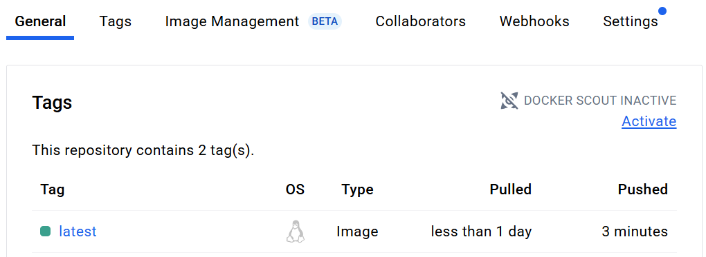

# YOLOv5 Object Detection API

[](https://github.com/Cheikh133/fastapi-yolo-object-detector/actions/workflows/docker-publish.yml)

[](https://hub.docker.com/r/cheikh331/fastapi-yolo)

A REST API using FastAPI and YOLOv5 to detect objects in images. Includes an interactive Swagger UI and a batch client script for automated testing.


## Table of Contents

- [Installation](#installation)
- [Testing](#testing)
- [Running the API](#running-the-api)
- [Run with Docker](#run-with-docker)
- [Interactive Docs](#interactive-docs)
- [API Endpoint](#api-endpoint)
- [Batch Processing with `client.py`](#batch-processing-with-clientpy)
- [Demo Output](#demo-output)
- [Docker Image Registry](#docker-image-registry)
- [Cleanup](#cleanup)
- [Threshold Analysis](#threshold-analysis)


## Installation

1. Clone the repository:
   ```bash
   git clone https://github.com/Cheikh133/fastapi-yolo-object-detector.git
   cd fastapi-yolo-object-detector
   ```

2. Create and activate a virtual environment:
    ```bash
    python -m venv .venv
    # Windows PowerShell
    .venv\Scripts\Activate.ps1
    # macOS/Linux
    source .venv/bin/activate
    ```
3. Install dependencies:

    ```bash
    pip install -r requirements.txt
    ```

## Testing

Run all unit and integration tests before you push:

```bash
pytest tests/ -q
```

All tests are also executed automatically in our GitHub Actions workflow.


## Running the API

Start the server with:  

```bash
uvicorn app.main:app --reload --host 127.0.0.1 --port 8000
```

## Run with Docker  

Pull the latest image and start the container:  

```bash
docker pull cheikh331/fastapi-yolo:latest
docker run -d --name yolo-api -p 8000:8000 cheikh331/fastapi-yolo:latest
```

Verify the container is running:

```bash
docker ps
```


## Interactive Docs

Access the interactive docs at `http://127.0.0.1:8000/docs`  


## API Endpoint

Send an image and receive an annotated result.

- **Endpoint**: `/predict/`  
- **Method**: `POST`  
- **Request**: multipart/form-data with `file=@<image>` and optional `?confidence=0.5`  
- **Response**: JPEG image with bounding boxes  

## Batch Processing with `client.py`

Process all images in `images/input/` and save results:
```bash
python client.py
```
Annotated images are saved to `images/output/annotated_<filename>`. The default confidence threshold is 0.50.

## Demo Output

Sample detection on a daytime street scene (`annotated_pic5.png`):


## Docker Image Registry

View the published image on Docker Hub:



Verify the push of all layers:


## Cloud Deployment (AWS Elastic Beanstalk)

Our Dockerized FastAPI + YOLOv5 app successfully launched in an Elastic Beanstalk environment:


## Cleanup

To stop and remove the container when you’re done:

```bash
docker stop yolo-api
docker rm yolo-api
```

## Threshold Analysis

[Open threshold_analysis.ipynb](notebooks/threshold_analysis.ipynb)

